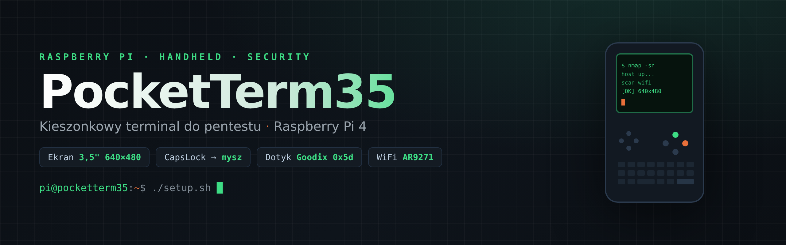

# PocketTerm35 — konfiguracja i skrypty

🇬🇧 [English version](README.en.md)

Zestaw plików, który stawia **Waveshare PocketTerm35** (handheld na Raspberry Pi) z działającym
ekranem dotykowym, klawiaturą i paroma wygodnymi narzędziami — plus moje skrypty pentestowe
do nauki bezpieczeństwa WiFi.

Sprzęt docelowy: **Raspberry Pi 4** w obudowie PocketTerm35, system **Raspberry Pi OS / Debian**
(działa też na Kali). Ekran 3,5" 640×480, dotyk Goodix GT911, klawiatura na układzie RP2040.

> ⚠️ **Uwaga prawna / etyczna.** Narzędzia z katalogu [`pentest/`](pentest/) służą do nauki
> bezpieczeństwa i testów **wyłącznie na własnych sieciach** albo tam, gdzie masz pisemną zgodę.
> Nieautoryzowany dostęp do cudzych sieci jest nielegalny. Używasz na własną odpowiedzialność.

---

## Co jest w repo

| Katalog / plik | Co to |
|---|---|
| [`pocketterm35/`](pocketterm35/) | Konfiguracja sprzętu: overlay dotyku, wpisy do `config.txt`, **mousekeys.py** (CapsLock → mysz) |
| [`scripts/restart-klawiatury.sh`](scripts/restart-klawiatury.sh) | Reset zawieszonej klawiatury (RP2040) |
| [`pentest/`](pentest/) | Skrypty do nauki bezpieczeństwa WiFi + narzędzie **pwnpet** |

---

## 1. Ekran dotykowy — uruchomienie (NAJWAŻNIEJSZE)

Panel dotykowy Goodix GT911 w tym egzemplarzu odpowiada pod adresem I2C **0x5d**, a oficjalny
overlay Waveshare `waveshare-35dpi-4b` szuka go pod **0x14** → dotyk nie działa. Rozwiązanie to
własny, malutki overlay tylko z `0x5d`.

```bash
cd pocketterm35
# 1. skompiluj overlay
dtc -@ -I dts -O dtb -o pocketterm35-touch.dtbo pocketterm35-touch.dts
# 2. skopiuj na partycję BOOT (RPi OS i Kali: /boot/firmware, NIE /boot jak pisze Waveshare)
sudo cp pocketterm35-touch.dtbo /boot/firmware/overlays/
# 3. dopisz zawartość config.txt.dopisz na koniec /boot/firmware/config.txt
cat config.txt.dopisz | sudo tee -a /boot/firmware/config.txt
# 4. reboot
sudo reboot
```

Weryfikacja po restarcie (szczegóły i obrót osi: [`pocketterm35/README.md`](pocketterm35/README.md)):
```bash
sudo i2cdetect -y 1          # ma być 5d
sudo dmesg | grep -i goodix  # ma być "ID 911"
```

## 2. CapsLock jako mysz (mousekeys.py)

Po wciśnięciu **CapsLock** strzałki ruszają kursorem jak myszką, a **L / R** to lewy / prawy
przycisk. Druga próba CapsLock wyłącza tryb (dioda CapsLock sygnalizuje stan).

```bash
# zależność
sudo apt install python3-evdev
# uruchom ręcznie (test)
python3 pocketterm35/mousekeys.py
```

**Autostart przy każdym bootowaniu** (gotowy unit systemd):
```bash
sudo cp pocketterm35/mousekeys.service /etc/systemd/system/
sudo systemctl daemon-reload
sudo systemctl enable --now mousekeys.service
```
> W unicie ścieżka do skryptu to `/home/pi/pocketterm35/mousekeys.py` — popraw, jeśli trzymasz go gdzie indziej.
> Dodatkowo w `mousekeys.py` zmienna `SOURCE_DEV` wskazuje konkretny serial klawiatury Pico
> (`by-id/...`) — jeśli u Ciebie będzie inny, podmień na swój (`ls /dev/input/by-id/`).

## 3. Reset zawieszonej klawiatury

Klawiatura PocketTerma bywa martwa po dłuższym leżakowaniu — zawiesza się układ RP2040.
Skrypt próbuje odzyskać ją programowo (re-enumeracja USB / wyjście z bootloadera), a jak się
nie da — podaje jedyny pewny fix (pełny power-cycle).

```bash
bash scripts/restart-klawiatury.sh
```

## 4. Narzędzia pentest

Patrz [`pentest/README.md`](pentest/README.md) — zarządzanie kartami WiFi i monitor sieci
**pwnpet**. **Tylko własne sieci / autoryzowane testy.**

---

Licencja: [MIT](LICENSE). Zdjęcia/firmware Waveshare nie są częścią tego repo.
